# Expense Tracker

A modern, user-friendly Flutter application for tracking personal expenses and income. Built with Firebase for secure authentication and data storage, featuring intuitive dashboards, category-based tracking, and report generation.

## Features

- **User Authentication**: Secure login and signup using Firebase Authentication
- **Expense & Income Tracking**: Add and manage expenses and income entries
- **Category Management**: Organize expenses into categories (Shopping, Grocery, Others)
- **Visual Dashboard**: Interactive donut chart showing expense distribution
- **Time Period Views**: Toggle between monthly and yearly expense summaries
- **Report Generation**: Download detailed reports in PDF or CSV format
- **Profile Management**: User profile with avatar and personal information
- **Data Persistence**: All data stored securely in Firebase Firestore

## Screenshots

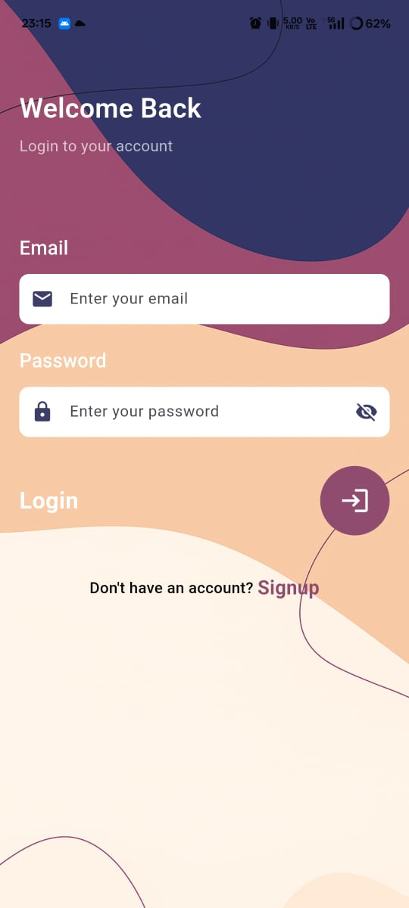
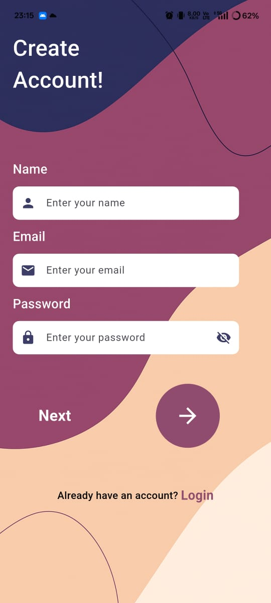

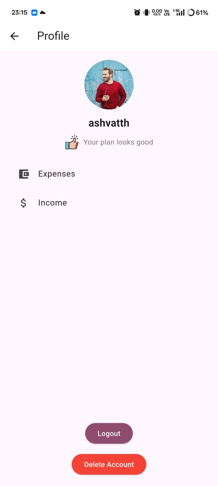
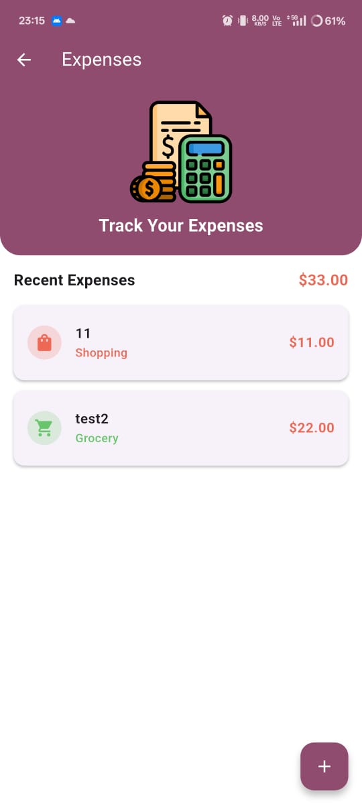
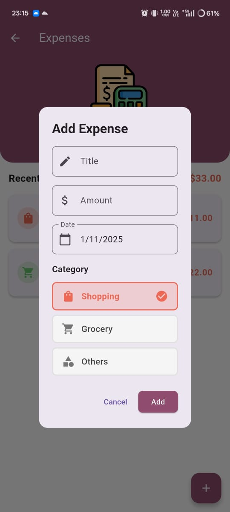
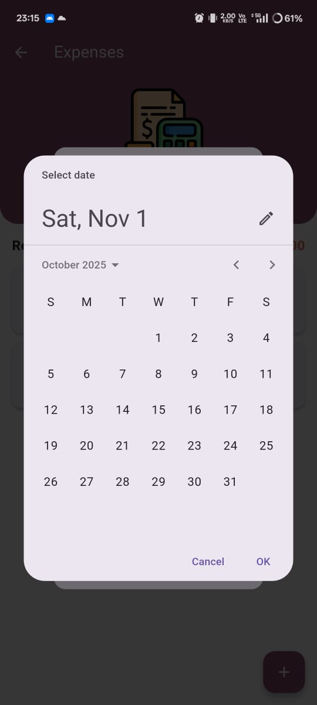
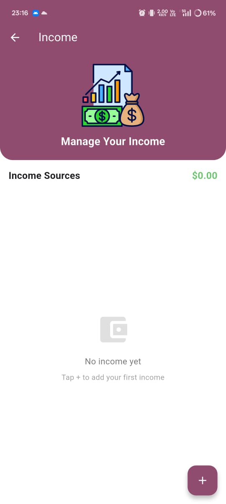
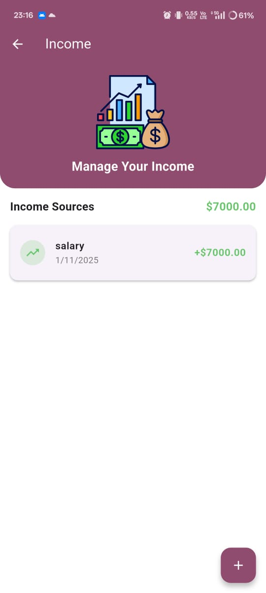
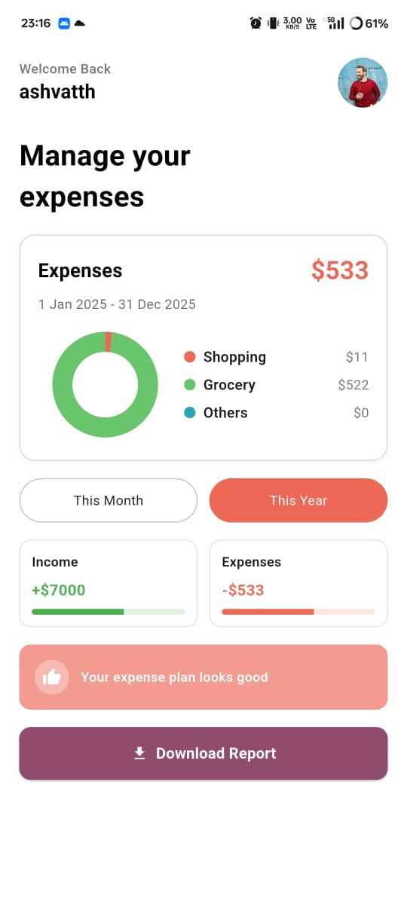
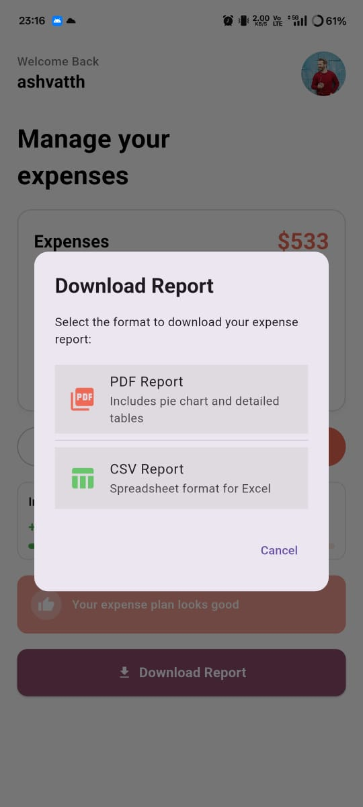
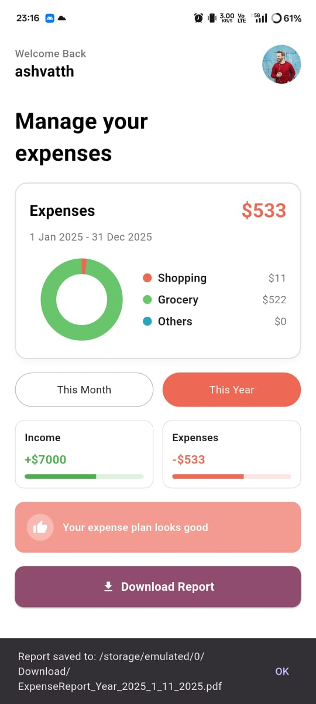
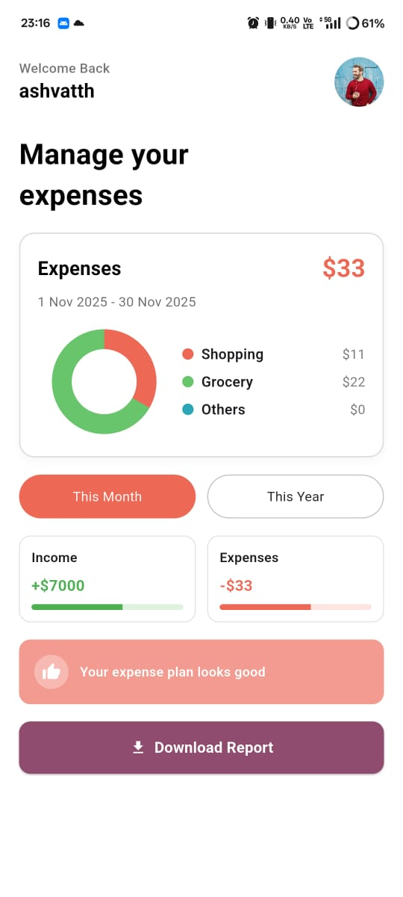
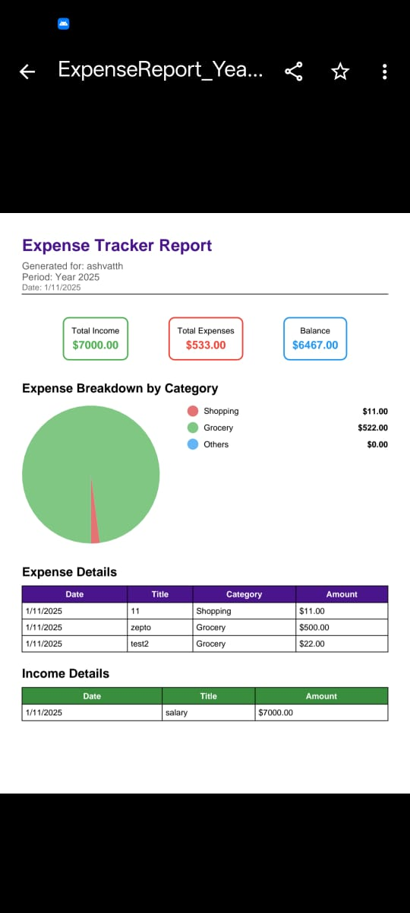

## Tech Stack

- **Framework**: Flutter
- **Language**: Dart
- **Backend**: Firebase (Authentication, Firestore)
- **State Management**: Provider pattern
- **Charts**: Custom painted donut chart
- **File Generation**: PDF and CSV export capabilities

## Usage

1. **Sign Up/Login**: Create an account or log in with existing credentials
2. **Add Expenses/Income**: Use the dedicated pages to add financial entries
3. **View Dashboard**: Check your expense breakdown with the interactive chart
4. **Switch Views**: Toggle between monthly and yearly summaries
5. **Generate Reports**: Download PDF or CSV reports for your records
6. **Manage Profile**: Update your profile information

## License

This project is licensed under the MIT License - see the [LICENSE](../LICENSE) file for details.

## Acknowledgments

- Built as part of Mobile Application Development coursework
- Uses Firebase for backend services
- Custom UI components for enhanced user experience
